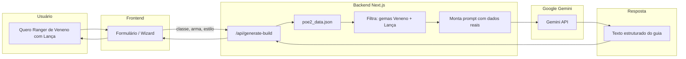

# Fluxo de dados: Geração de build com IA

Exemplo: **"Quero Ranger de Veneno com Lança."**

## Diagrama

## Passo a passo

| Etapa | Quem | O quê |
|-------|------|--------|
| 1 | **Usuário** | Informa: classe (Ranger), arma (Lança), estilo (Veneno). |
| 2 | **Frontend** | Envia POST para `/api/generate-build` com `{ classe, arma, estilo }`. |
| 3 | **Backend** | Lê `poe2_data.json` e filtra: "Quais são as gemas de Veneno e Lança no PoE2DB?" |
| 4 | **Backend** | Monta o prompt: "Gemini, aqui estão os dados reais do PoE2DB [Dados]. Com base neles, crie um guia curto para um iniciante que quer jogar de Ranger de Veneno." |
| 5 | **Gemini** | Retorna o texto estruturado do guia. |
| 6 | **Backend** | Devolve a resposta para o frontend (JSON). |
| 7 | **Frontend** | Exibe o guia de forma formatada para o usuário. |

## Segurança

- A **API Key** do Gemini fica apenas no servidor, em variável de ambiente (`.env`).
- O frontend nunca acessa a chave; apenas chama a API do Next.js.
